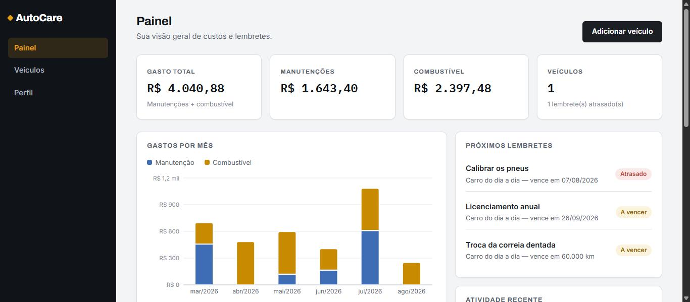
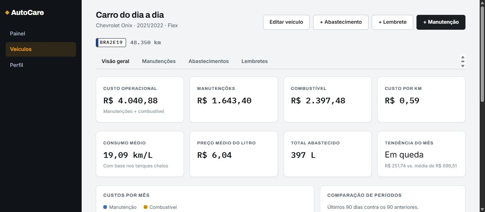

# AutoCare

Vehicle maintenance tracker built as a three-service platform: a Spring Boot
API, a FastAPI analytics service, and a React SPA. You register your vehicles,
log maintenance and refuelings, and the platform turns those records into
numbers that actually mean something — cost per kilometre, real fuel
consumption, and what falls due next.

The interface is in Brazilian Portuguese; the code, commits and documentation
are in English.

[](https://github.com/thisantanadev/autocare-platform/actions/workflows/ci.yml)

## Screens

Every figure below shows the fictional demo dataset seeded by the `demo`
profile — no real vehicle, person or plate.


*Landing page. The instrument gauges are pure CSS — the project ships no images.*



*Dashboard. Spend totals, monthly expenses split between maintenance and fuel, and reminders flagged the moment they fall overdue.*



*Vehicle overview. Cost per kilometre and real fuel consumption, computed by the Python analytics service from full-tank refuelings.*

## Why three services

The split is deliberate rather than decorative:

| Service | Stack | Responsibility |
|---|---|---|
| `backend/` | Java 21, Spring Boot 4, PostgreSQL, Flyway | System of record: authentication, ownership rules, CRUD, persistence |
| `analytics/` | Python 3.12, FastAPI, Pydantic | Pure calculation: costs, fuel efficiency, trends. No database, no browser access |
| `frontend/` | React 19, Vite, React Router, Recharts | The SPA, served by nginx in production |

The analytics service is stateless and deterministic: the backend sends it a
sanitized snapshot of one vehicle's records and gets a report back. It holds no
data of its own, so it can be scaled, restarted or replaced freely — and when it
is unreachable, the rest of the application keeps working, with the vehicle page
degrading to a notice instead of an error.

## Features

- **Vehicles** — brand, model, years, Brazilian plate validation (`ABC1D23` and
  the older `ABC1234`), odometer, fuel type, optional nickname
- **Maintenance records** — 13 categories, cost, workshop, mileage, and the next
  service due by date or by mileage
- **Fuel entries** — litres, total paid, derived price per litre, full-tank flag
  that drives the consumption calculation
- **Reminders** — due by date, by mileage, or both; automatically flagged overdue
- **Dashboard** — spend totals, monthly stacked expenses, spend by category,
  overdue reminders, recent activity
- **Per-vehicle analytics** — operating cost, cost per kilometre, average
  consumption, period-over-period comparison, upcoming maintenance

Recording maintenance or a refueling with a higher odometer reading advances the
vehicle's mileage automatically, and a vehicle's mileage can never be edited
below the highest reading already recorded.

## Quick start with Docker

Docker Compose is the fastest path — it brings up PostgreSQL, both services and
the SPA:

```bash
cp .env.example .env       # then set JWT_SECRET and ANALYTICS_INTERNAL_TOKEN
docker compose up --build
```

Open <http://localhost:8081>. The stack starts with the `demo` Spring profile
active, which seeds one fictional account on first boot:

> **Sample data, not a real account.** These credentials belong to a throwaway
> account created locally by `DemoDataSeeder`, alongside an invented vehicle,
> service history and refuelings. They grant access to nothing beyond your own
> machine, and the seeder never runs outside the `demo` profile.

- **E-mail:** `demo@autocare.dev`
- **Password:** the `DEMO_USER_PASSWORD` from your `.env` (default `DemoAutoCare123`)

Set `SPRING_PROFILES_ACTIVE=` in `.env` for an empty database instead.

Published ports: SPA on `8081`, API on `8080`, PostgreSQL on `5433` (mapped off
5432 so it will not collide with a PostgreSQL installed on the host). The
analytics service is intentionally not published.

## Running natively

Requires JDK 21, Node 24, Python 3.12 and PostgreSQL 18.

**1. Database**

```bash
psql -U postgres -c "CREATE ROLE autocare LOGIN PASSWORD 'autocare';"
psql -U postgres -c "CREATE DATABASE autocare OWNER autocare;"
```

Flyway applies `V1`–`V6` on the first backend start.

**2. Analytics service** (port 8000)

```bash
cd analytics
uv sync --group dev
ANALYTICS_INTERNAL_TOKEN=dev-only-internal-token uv run uvicorn app.main:app --port 8000
```

**3. Backend** (port 8080)

```bash
cd backend
./mvnw spring-boot:run -Dspring-boot.run.profiles=dev
```

The `dev` profile supplies a development JWT secret, sets `COOKIE_SECURE=false`
for plain-HTTP localhost, and matches the analytics token above. Add `,demo` to
the profile list to seed the demo account.

**4. Frontend** (port 5173)

```bash
cd frontend
npm install
npm run dev
```

Vite proxies `/api` to `localhost:8080`, so the refresh cookie stays
first-party. In production nginx does the same thing — see
[`frontend/nginx.conf.template`](frontend/nginx.conf.template).

## Tests

```bash
cd backend   && ./mvnw test     # 52 tests — services, auth flow, ownership isolation
cd frontend  && npm test        # 80 tests — pages, forms, API client, formatters
cd analytics && uv run pytest   # calculation and API tests
```

Backend tests run on H2 in PostgreSQL compatibility mode for speed, so the
Flyway migrations are verified separately against a real PostgreSQL 18 server in
CI, where a successful boot with `ddl-auto=validate` proves the migrations and
the JPA mappings agree.

### End-to-end validation

With the stack running (see [Running natively](#running-natively) or Docker),
`scripts/e2e-validation.sh` exercises the live API against real PostgreSQL and
prints every step with its actual HTTP status:

```bash
bash scripts/e2e-validation.sh                                   # native stack
API_BASE=http://localhost:8081/api/v1 bash scripts/e2e-validation.sh   # Docker stack
```

43 checks covering the full journey (register, login, vehicle, maintenance,
fuel, reminders, dashboard, analytics), the validation and business rules,
refresh-token rotation with reuse detection, and cross-user data isolation. It
exits non-zero if any check fails, and registers timestamped accounts so it is
safe to re-run against the same database. Requires `curl` and `node`.

## Documentation

- [`docs/ARCHITECTURE.md`](docs/ARCHITECTURE.md) — service boundaries, data model, request flow
- [`docs/API.md`](docs/API.md) — REST endpoint reference
- [`docs/SECURITY.md`](docs/SECURITY.md) — authentication, token handling, threat notes

Interactive API docs (Swagger UI) are served at
<http://localhost:8080/swagger-ui.html> while the backend runs.

## License

[MIT](LICENSE) © 2026 Thiago De Andrade
